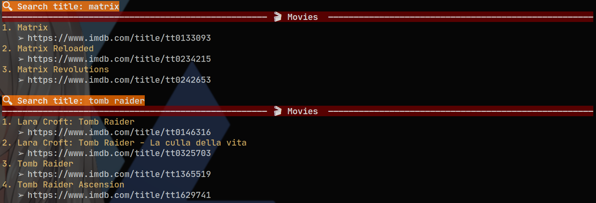
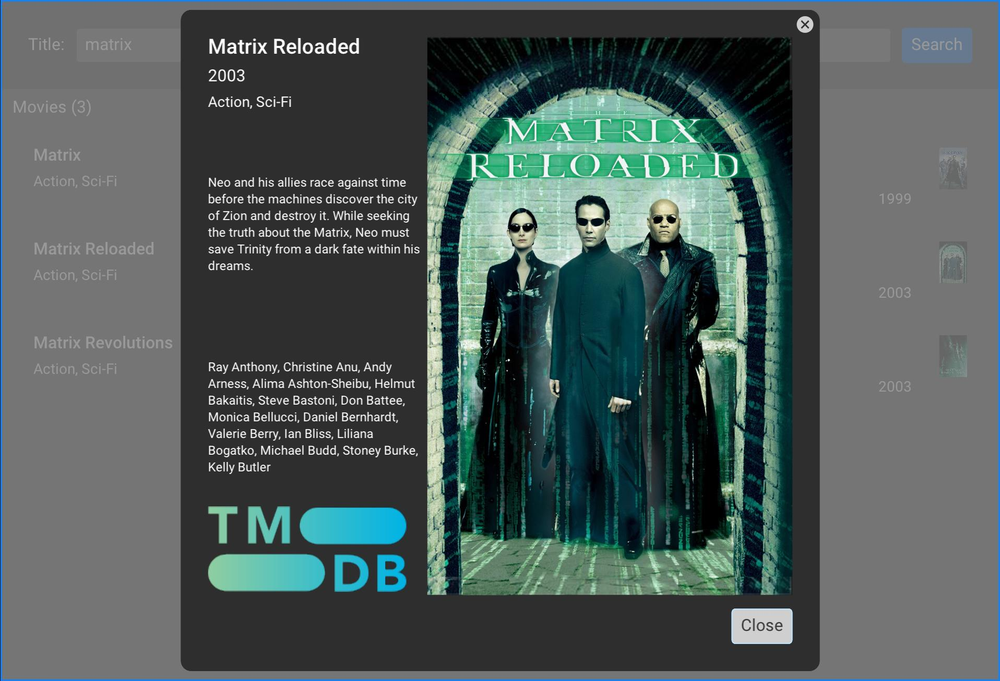

fts (full-text search)
======================

[](https://github.com/gvolpe/fts/actions)

Full-text search demo powered by PostgreSQL, inspired by [this article](https://blog.crunchydata.com/blog/postgres-full-text-search-a-search-engine-in-a-database).

## Overview

There are three components in this project: the dataset loader and both full-text search applications: a console app and a GUI app, described below.

The idea behind this demo project is to showcase the full-text search feature offered by PostgreSQL, as well as another example of a native multi-platform desktop GUI application written in Haskell.

It also showcases the power of functional effectful streams on the Scala side.

Overall, it was just a fun pet project :nerd_face:

### System requirements

Before anything else, we need a PostgreSQL instance up and running. You can use the supplied [docker-compose.yml](./docker-compose.yml) file, or have your own instance running.

If you care about reproducibility, then [Nix](https://nixos.org/) is your best friend. If not, you can try and build the project via `cabal new-build`, good luck with that :wink:

```shell
$ cachix use fts
$ nix-build
...
$ ls result/bin/
fts fts-ui
```

The first command is optional but recommended, if you don't want to compile the world! Once the build is complete, you'll find two executables corresponding the two applications described below.

### Full-text search console app

In the console app, you can search movies by title (hit `Ctrl + C` to exit).



**NOTE**: Your terminal needs to support the rendering of emojis and Unicode characters. Make sure you have a modern font installed in your system. In my case, I use [Alacritty](https://github.com/alacritty/alacritty) and [JetBrainsMono](https://www.jetbrains.com/lp/mono/).

### Full-text search GUI app

The GUI application is richer in features, powered by the [monomer](https://hackage.haskell.org/package/monomer) package, and adapted from the [books example](https://github.com/fjvallarino/monomer/blob/main/docs/examples/02-books.md).



In addition to searching movies in Postgres, it tries to fetch the movie poster from [TMDB](https://www.themoviedb.org/), if the `TMDB_API_KEY` environment variable is set. To get one, have a look at the [instructions](https://developers.themoviedb.org/3/getting-started/introduction).

**NOTE**: Non-NixOS users need to run `fts-ui` via [nixGL](https://github.com/guibou/nixGL), due to some complicated OpenGL linking issues. TL;DR:

```shell
$ nix-channel --add https://github.com/guibou/nixGL/archive/main.tar.gz nixgl
$ nix-channel --update
$ nix-env -iA nixgl.auto.nixGLDefault
```

Then run the program as `nixGL result/bin/fts-ui` instead.

### Dataset loader

The loader is a nix shell script interpreted by [Ammonite](http://ammonite.io/), written in Scala, which reads a movies CSV file, parses its content, and it stores them in Postgres. These tasks are made easy by [fs2](https://fs2.io), [fs2-data](https://github.com/satabin/fs2-data), and [skunk](https://github.com/tpolecat/skunk).

```shell
$ cd data
$ ./Loader.sc
```

If you wish to change the Postgres connection details, have a look at the [configuration file](data/DB.sc).

### Technical details

Every time a title is entered, a full-text search is performed against Postgres via the following query, which orders the results by the corresponding ranking (`ts_rank`).

```sql
SELECT title_id, title, genre, year, language, description, actors
FROM movies
WHERE ts @@ to_tsquery('english', ?)
ORDER BY ts_rank(ts, to_tsquery('english', ?)) DESC
```

The console application only displays the title together with a link to the movie in [imdb](https://www.imdb.com/) but anything should be possible with a bit of customization, as done in the GUI application.

## Dataset License

The movies dataset is licensed under [CC0 1.0](https://creativecommons.org/publicdomain/zero/1.0/), downloaded from [here](https://www.kaggle.com/stefanoleone992/imdb-extensive-dataset).
