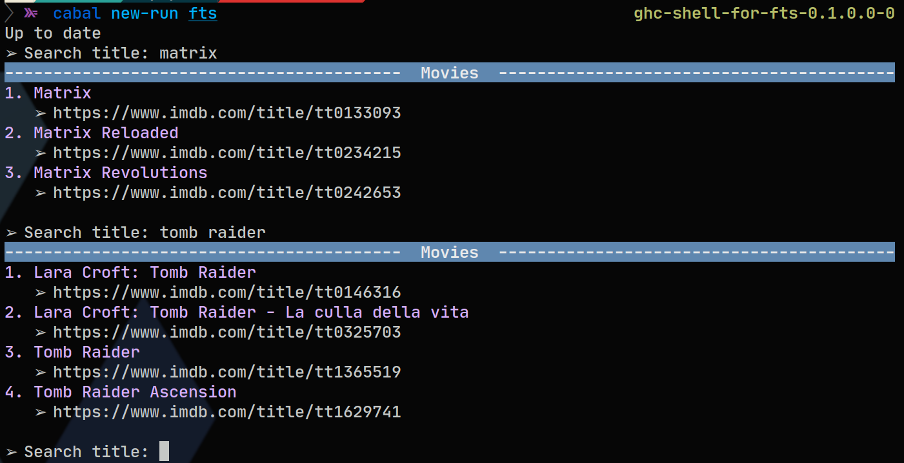
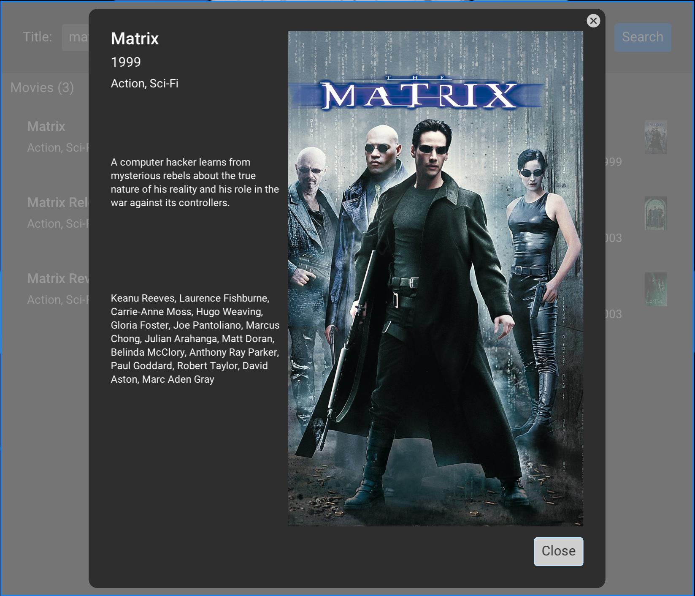

fts (full-text search)
======================

[](https://github.com/gvolpe/fts/actions)

Full-text search demo powered by PostgreSQL, inspired by [this article](https://blog.crunchydata.com/blog/postgres-full-text-search-a-search-engine-in-a-database).

## Overview

There are three components in this project: the dataset loader and both full-text search applications: a console app and a GUI app.

### System requirements

Before anything else, we need a PostgreSQL instance up and running. You can use the supplied [docker-compose.yml](./docker-compose.yml) file, or have your own instance running.

### Full-text search console app

In the console app, you can search movies by title. Run it as follows.

```shell
$ cabal new-run fts
```



Hit `Ctrl + C` to exit.

### Full-text search GUI app

The GUI application is richer in features, powered by the [monomer](https://hackage.haskell.org/package/monomer) package.

```shell
$ cabal new-run fts-ui
```



In addition to search movies in Postgres, it tries to fetch the movie poster from [TMDB](https://www.themoviedb.org/), if the `TMDB_API_KEY` environment variable is set.

### Dataset loader

The loader is a nix shell script interpreted by [Ammonite](http://ammonite.io/), written in Scala, which reads a movies CSV file, parses its content, and it stores them in Postgres. These tasks are made easy by [fs2](https://fs2.io), [fs2-data](https://github.com/satabin/fs2-data), and [skunk](https://github.com/tpolecat/skunk).

```shell
$ cd data
$ ./Loader.sc
```

If you wish to change the Postgres connection details, have a look at the [configuration file](data/DB.sc).

### Technical details

Every time a title is entered in the console, a full-text search is performed against Postgres via the following query, which orders the results by the corresponding ranking (`ts_rank`).

```sql
SELECT title_id, title, genre, country, language
FROM movies
WHERE ts @@ to_tsquery('english', ?)
ORDER BY ts_rank(ts, to_tsquery('english', ?)) DESC
```

The console application only displays the title together with a link to the movie in [imdb](https://www.imdb.com/) but anything should be possible with a bit of customization.

## Dataset License

The movies dataset is licensed under [CC0 1.0](https://creativecommons.org/publicdomain/zero/1.0/), downloaded from [here](https://www.kaggle.com/stefanoleone992/imdb-extensive-dataset).
